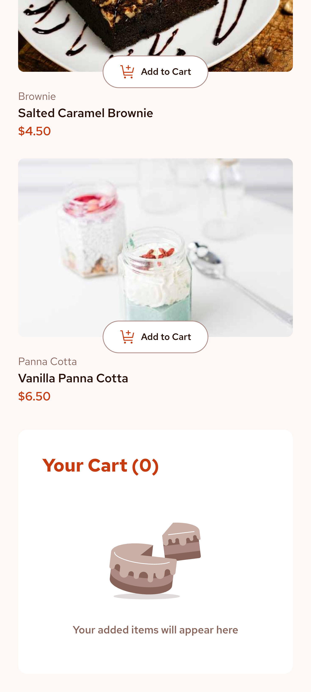
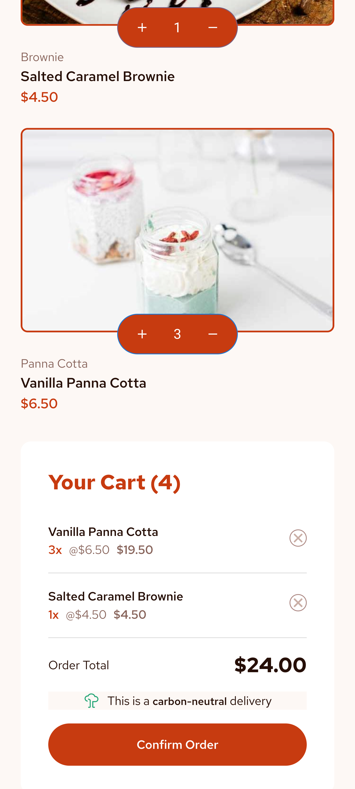
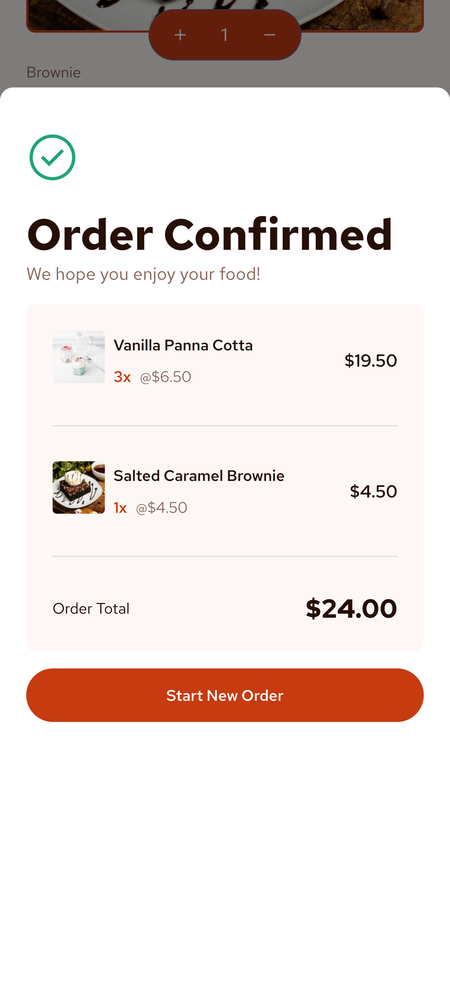
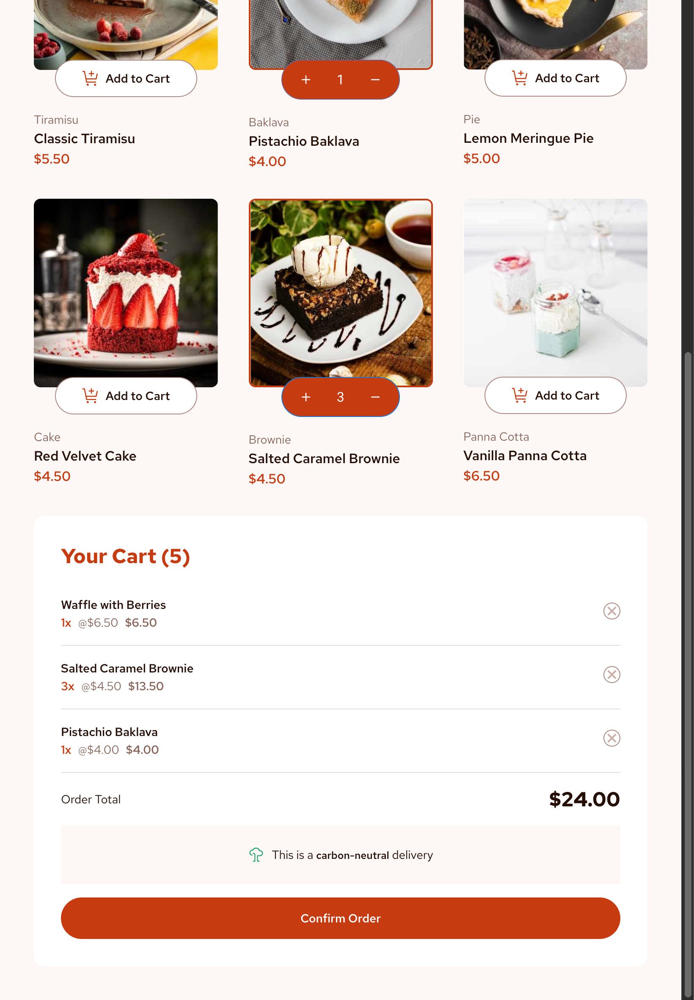
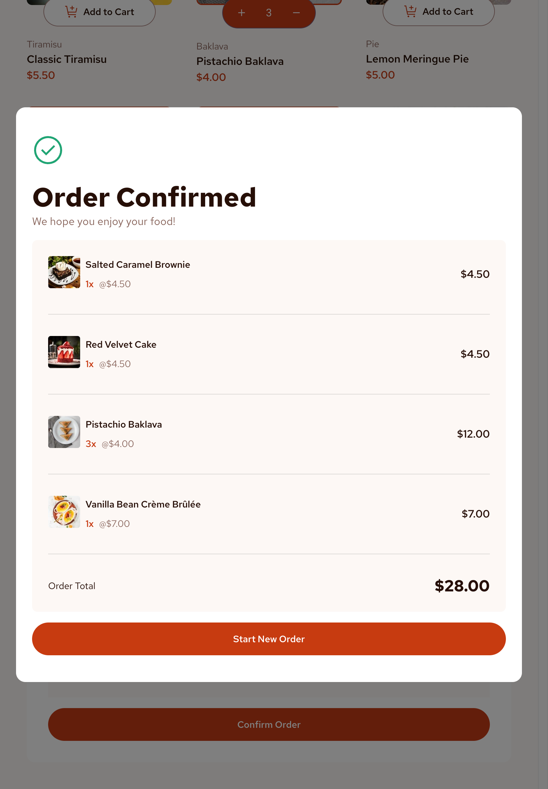
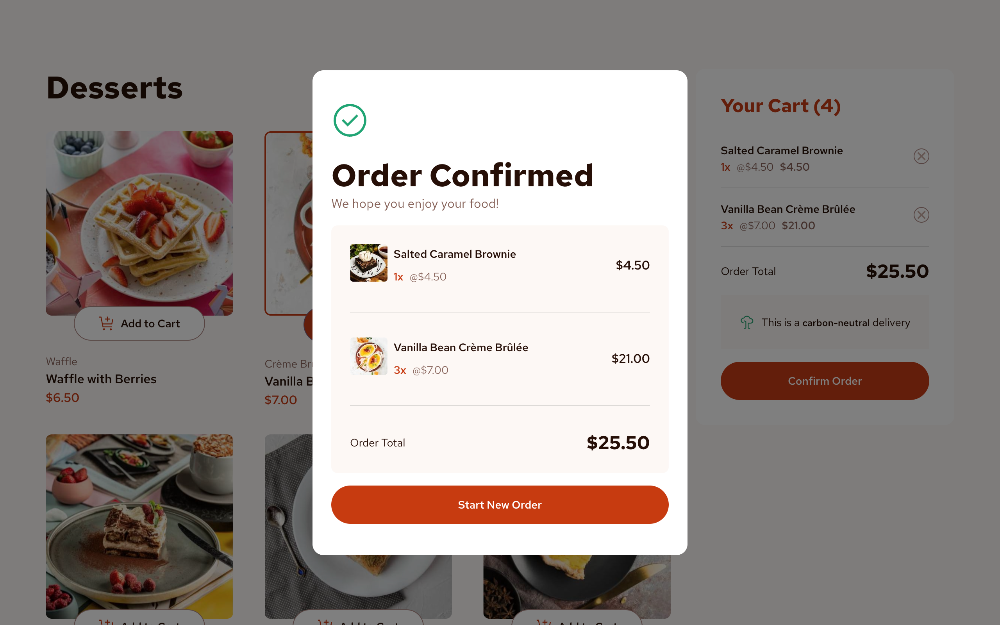

# Wolf Product List (with Cart)

## Table of Contents

- [Overview](#overview)
  - [App Features](#app-features)
  - [Screenshots](#screenshots)
    - [Mobile](#mobile)
  - [App Links](#app-links)
- [Author](#author)

## Overview

### App Features

Users will be able to:

- Add items to the cart and remove them
- Increase/decrease the number of items in the cart
- See an order confirmation modal when they click "Confirm Order"
- Reset their selections when they click "Start New Order"
- View the optimal layout for the interface depending on their device's screen size
- See hover and focus states for all interactive elements on the page

### Screenshots

#### Mobile

On Loading the App

Empty Cart

Adding Items into the Cart

Confirmation

#### Tablet

On Loading the App

Empty Cart

Adding Items into the Cart

Confirmation

#### Desktop

On Loading the App

Adding Items into the Cart

Confirmation

### App Links

[Wolf Product List (with Cart)](https://mckoyd.github.io/wolf-product-list/)

## Author

This is a Wolf Production engineered by Dominick McKoy.
